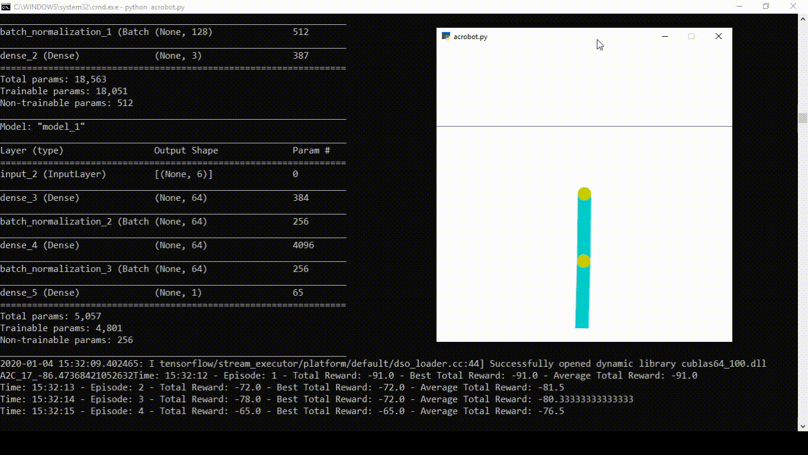

# Acrobot-v1

Trial 1
- Episodes of Random Agent (exploring): 200
- Episodes of DQN Agent (convergence episodes): 20
- Algorithm: Dueling DQN with target model
- Critic
  - Model: 
      - Input -> Dense(64) -> ReLu -> BatchNorm -> S
      - S -> Dense(64) -> ReLu -> BatchNorm -> dense(1) -> V
      - S -> Dense(64) -> ReLu -> BatchNorm -> dense(3) -> A
      - [V, A] -> Lambda(A+V-mean(A)) -> Output
  - Optimizer: Adam(.01)
  - Loss: mean absolute error
- Agent Parameters
  - Discount Rate: .99
  - Memory: 200000
  - Target Model: True
  - Prioritized Experience Replay: False
  - Double Q Learning: False
  - Policy: Stochastic Greedy Policy
      - Exponential Decay of stochasticity: max((1-.001)^num_steps, .01)
- Learning Parameters
  - Batch Size: 32
  - Mini-Batch size (Sample size from all experience): 10000
  - Learns in episode (takes gradient steps per episode step): False
  - Epochs (Number of complete gradient steps per episode): 1
  - Target Update Interval: 1 episode
  - tau (soft target update, hard=1): .01
- Results
  - Best 100-episode performance: -106.9
  - Highest Score within best 100-episode: -71
  - Lowest Score within best 100-episode: -305

 
Trial 2
- Episodes of Random Agent (exploring): 200
- Episodes of A2C Agent (convergence episodes): 360
- Algorithm: Advantage Actor Critic
- Actor
  - Model: Input -> Dense(128) -> ReLu -> BatchNorm -> Dense(128) -> ReLu -> BatchNorm -> Dense(3) -> Softmax
  - Optimizer: Adam(.003)
- Critic
  - Model: Input -> Dense(64) -> ReLu -> BatchNorm -> Dense(64) -> ReLu -> BatchNorm -> Dense(1)
  - Optimizer: Adam(.01)
  - Loss: mean squared error
- Agent Parameters
  - Discount Rate (gamma): .99
  - Lambda Rate (enables GAE > 0): .95
  - Memory: 200000
- Learning Parameters
  - Batch Size: 64
  - Mini-Batch size (Sample size from all experience): 10000
  - Epochs (Number of complete gradient steps per episode): 1
- Results
  - Best 100-episode performance mean: -74.49
  - Best 100-episode performance standard deviation: 10.87
  - Highest Score within best 100-episode: -63
  - Lowest Score within best 100-episode: -125

Note: The weights provided can be loaded with TensorFlow Keras, and the code below uses my PAI-Utils package (at some point it will be released)

Trial 1 and 2 Code
```python
import gym 
import numpy as np
import tensorflow as tf
from tensorflow import keras
from paiutils.reinforcement import (
    DQNAgent, StochasticPolicy, GreedyPolicy,
    ExponentialDecay, RingMemory, Memory, GymWrapper
)
from paiutils.reinforcement_agents import (
    A2CAgent
)
from paiutils.neural_network import (
    dense
)


def create_amodel(state_shape, action_shape):
    inputs = keras.layers.Input(shape=state_shape)
    x = dense(128)(inputs)
    x = dense(128)(x)
    outputs = dense(action_shape[0], activation='softmax',
                    batch_norm=False)(x)
    
    amodel = keras.Model(inputs=inputs,
                         outputs=outputs)
    amodel.compile(optimizer=keras.optimizers.Adam(.003),
                   loss='mse', experimental_run_tf_function=False)
    amodel.summary()
    return amodel


def create_qmodel(state_shape, action_shape):
    inputs = keras.layers.Input(shape=state_shape)
    x = dense(64)(inputs)
    x1 = dense(64)(x)
    x2 = dense(64)(x)
    #outputs = keras.layers.Dense(action_shape[0])(x)
    outputs = DQNAgent.get_dueling_output_layer(action_shape, 
                                                dueling_type='avg')(x1, x2)
    qmodel = keras.Model(inputs=inputs,
                         outputs=outputs)
    qmodel.compile(optimizer=keras.optimizers.Adam(.01),
                   loss='mae', experimental_run_tf_function=False)
    qmodel.summary()
    return qmodel


def create_cmodel(state_shape):
    inputs = keras.layers.Input(shape=state_shape)
    x = dense(64)(inputs)
    x = dense(64)(x)
    outputs = keras.layers.Dense(1)(x)

    cmodel = keras.Model(inputs=inputs,
                         outputs=outputs)
    cmodel.compile(optimizer=keras.optimizers.Adam(.01),
                   loss='mse', experimental_run_tf_function=False)
    cmodel.summary()
    return cmodel


if __name__ == '__main__':
    config = tf.compat.v1.ConfigProto()
    config.gpu_options.allow_growth = True   
    sess = tf.compat.v1.Session(config=config)

    # Solved = Undefined ~= -42.37 avg. reward over 100 episodes

    solved = -42.37
    save_dir = 'acrobot_saves/'
    env = gym.make('Acrobot-v1')
    max_steps = env._max_episode_steps  # (500)
    env = GymWrapper(env, (6,), (3,))

    agents_to_use = ['DQN', 'A2C']
    agent_to_use = agents_to_use[0]

    if agent_to_use == 'DQN':
        policy = StochasticPolicy(
            GreedyPolicy(), ExponentialDecay(1, .001, .01),
            .01, np.prod(env.action_shape)
        )
        qmodel = create_qmodel(env.state_shape, env.action_shape)
        agent = DQNAgent(policy, qmodel, .99,
                         create_memory=lambda: RingMemory(200000),
                         enable_target=True, enable_double=False, 
                         enable_PER=False)

        agent.set_playing_data(training=False, memorizing=True)
        env.play_episodes(agent, 200, max_steps, random=True,
                          verbose=True, episode_verbose=False,
                          render=False)

        agent.set_playing_data(training=True, memorizing=True, 
                               learns_in_episode=False, batch_size=32, 
                               mini_batch=10000, epochs=1,
                               verbose=True, target_update_interval=1, tau=.01)
        for ndx in range(1):
            print(f'Save Loop: {ndx}')
            env.play_episodes(agent, 1, max_steps,
                              verbose=True, episode_verbose=False,
                              render=True)
            result = env.play_episodes(agent, 19, max_steps,
                                       verbose=True, episode_verbose=False,
                                       render=False)
            agent.save(save_dir, note=f'DQN_{ndx}_{result}')
            if result >= solved:
                break

        agent.set_playing_data(training=False, memorizing=False)
        avg = env.play_episodes(agent, 100, max_steps,
                                verbose=True, episode_verbose=False,
                                render=False)
        print(len(agent.states))
        print(avg)
    elif agent_to_use == 'A2C':
        amodel = create_amodel(env.state_shape, env.action_shape)
        cmodel = create_cmodel(env.state_shape)
        agent = A2CAgent(amodel, cmodel, .99, lambda_rate=.95,
                         create_memory=lambda: RingMemory(200000))

        agent.set_playing_data(training=False, memorizing=True)
        env.play_episodes(agent, 200, max_steps, random=True,
                          verbose=True, episode_verbose=False,
                          render=False)

        agent.set_playing_data(training=True, memorizing=True,
                               batch_size=64, mini_batch=10000, epochs=1,
                               entropy_coef=0,
                               verbose=True)
        for ndx in range(18):
            print(f'Save Loop: {ndx}')
            env.play_episodes(agent, 1, max_steps,
                              verbose=True, episode_verbose=False,
                              render=True)
            result = env.play_episodes(agent, 19, max_steps,
                                       verbose=True, episode_verbose=False,
                                       render=False)
            agent.save(save_dir, note=f'A2C_{ndx}_{result}')
            if result >= solved:
                break

        agent.set_playing_data(training=False, memorizing=False)
        avg = env.play_episodes(agent, 100, max_steps,
                                verbose=True, episode_verbose=False,
                                render=False)
        print(len(agent.states))
        print(avg)
```

Gameplay from the trial 2 agent

