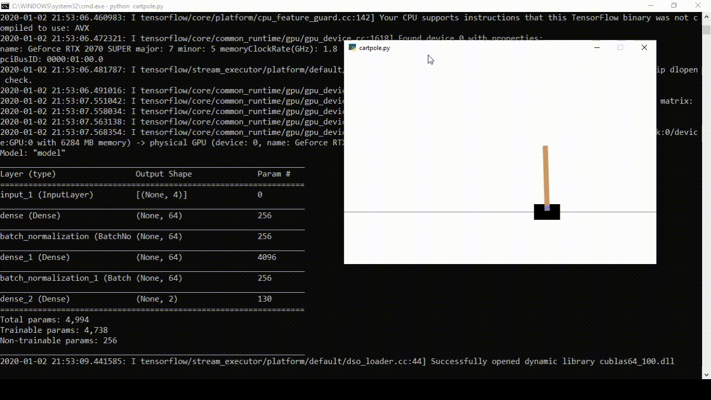

# CartPole-v0

Trial 1
- Episodes of Random Agent (exploring): 1000
- Episodes of Policy Gradient Agent (convergence episodes): 0
- Algorithm: Policy Gradients (No Critic)
- Actor
  - Model: Input -> Dense(64) -> ReLu -> BatchNorm -> Dense(64) -> ReLu -> BatchNorm -> Dense(2) -> Softmax
  - Optimizer: Adam(.001)
- Agent Parameters
  - Discount Rate: .99
  - Memory: 200000
- Learning Parameters
  - Batch Size: 32
  - Mini-Batch size (Sample size from all experience): All
  - Epochs (Number of complete gradient steps): 10
- Results
  - Average Total Reward over 100 Episodes: 2000
  - Number of Rewards of 200: 100/100
 
Trial 2
- Episodes of Random Agent (exploring): 1
- Episodes of Policy Gradient Agent (convergence episodes): 100
- Algorithm: Policy Gradients (No Critic)
- Actor
  - Model: Input -> Dense(64) -> ReLu -> BatchNorm -> Dense(64) -> ReLu -> BatchNorm -> Dense(2) -> Softmax
  - Optimizer: Adam(.003)
- Agent Parameters
  - Discount Rate: .99
  - Memory: 200000 (Larger than needed)
- Learning Parameters
  - Batch Size: 32
  - Mini-Batch size (Sample size from all experience): 10000
  - Epochs (Number of complete gradient steps per episode): 1
- Results
  - Average Total Reward over 100 Episodes: 199.59
  - Number of Rewards of 200: 99/100
  - Rewards other than 200: 159

Trial 3
- Episodes of Random Agent (exploring): 1
- Episodes of Policy Gradient Agent (convergence episodes): 40
- Algorithm: Advantage Actor Critic
- Actor
  - Model: Input -> Dense(64) -> ReLu -> BatchNorm -> Dense(64) -> ReLu -> BatchNorm -> Dense(2) -> Softmax
  - Optimizer: Adam(.003)
- Critic
  - Model: Input -> Dense(64) -> ReLu -> BatchNorm -> Dense(64) -> ReLu -> BatchNorm -> Dense(1)
  - Optimizer: Adam(.001)
  - Loss: mean squared error
- Agent Parameters
  - Discount Rate: .99
  - Memory: 200000 (Larger than needed)
- Learning Parameters
  - Batch Size: 64
  - Mini-Batch size (Sample size from all experience): 10000
  - Epochs (Number of complete gradient steps per episode): 1
- Results
  - Average Total Reward over 100 Episodes: 200
  - Number of Rewards of 200: 100/100


Note: The weights provided can be loaded with TensorFlow Keras, and the code below uses my AI utils package (at some point it will be released)

Trial 1 Code
```python
import gym 
import numpy as np
import tensorflow as tf
from tensorflow import keras
from paiutils.reinforcement import (
    PGAgent, RingMemory, GymWrapper
)
from paiutils.neural_network import (
    dense
)

def create_amodel(state_shape, action_shape):
    inputs = keras.layers.Input(shape=state_shape)
    x = dense(64)(inputs)
    x = dense(64)(x)
    outputs = dense(action_shape[0], activation='softmax',
                    batch_norm=False)(x)
    
    amodel = keras.Model(inputs=inputs,
                         outputs=outputs)
    # Loss provided does not matter
    amodel.compile(optimizer=keras.optimizers.Adam(.003),
                   loss='mse', experimental_run_tf_function=False)
    amodel.summary()
    return amodel

solved = 195
save_dir = 'cartpole_saves/'
env = gym.make('CartPole-v0')
max_steps = env._max_episode_steps  # (200)

env = GymWrapper(env, (4,), (2,))

policy = None
amodel = create_amodel(env.state_shape, env.action_shape)
agent = PGAgent(amodel, .99, create_memory=lambda: RingMemory(200000),
                policy=policy)

agent.set_playing_data(training=False, memorizing=True, verbose=True)
env.play_episodes(agent, 1000, max_steps, random=True,
                  verbose=True, episode_verbose=False,
                  render=False)
agent.learn(batch_size=32, epochs=10)
agent.save(save_dir, note=f'PG')

agent.set_playing_data(training=False, memorizing=False, verbose=True)
avg = env.play_episodes(agent, 100, max_steps,
                        verbose=True, episode_verbose=False,
                        render=False)
print(len(agent.states))
print(avg)
```

Trial 2 Code
```python
import gym 
import numpy as np
import tensorflow as tf
from tensorflow import keras
from paiutils.reinforcement import (
    PGAgent, RingMemory, GymWrapper
)
from paiutils.neural_network import (
    dense
)

def create_amodel(state_shape, action_shape):
    inputs = keras.layers.Input(shape=state_shape)
    x = dense(64)(inputs)
    x = dense(64)(x)
    outputs = dense(action_shape[0], activation='softmax',
                    batch_norm=False)(x)
    
    amodel = keras.Model(inputs=inputs,
                         outputs=outputs)
    # Loss provided does not matter
    amodel.compile(optimizer=keras.optimizers.Adam(.003),
                   loss='mse', experimental_run_tf_function=False)
    amodel.summary()
    return amodel

solved = 195
save_dir = 'cartpole_saves/'
env = gym.make('CartPole-v0')
max_steps = env._max_episode_steps  # (200)

env = GymWrapper(env, (4,), (2,))

policy = None
amodel = create_amodel(env.state_shape, env.action_shape)
agent = PGAgent(amodel, .99, create_memory=lambda: RingMemory(200000),
                policy=policy)

agent.set_playing_data(training=False, memorizing=True, verbose=True)
env.play_episodes(agent, 1, max_steps, random=True,
                  verbose=True, episode_verbose=False,
                  render=False)

agent.set_playing_data(training=True, memorizing=True,
                       batch_size=32, mini_batch=10000, epochs=1, 
                       entropy_coef=0,
                       verbose=True)
for ndx in range(2):
    print(f'Save Loop: {ndx}')
    result = env.play_episodes(agent, 50, max_steps,
                               verbose=True, episode_verbose=False,
                               render=False)
    agent.save(save_dir, note=f'PG_{ndx}_{result}')
    if result >= solved:
        break

agent.set_playing_data(training=False, memorizing=False, verbose=True)
avg = env.play_episodes(agent, 100, max_steps,
                        verbose=True, episode_verbose=False,
                        render=False)
print(len(agent.states))
print(avg)
```

Trial 3 Code
```python
import gym 
import numpy as np
import tensorflow as tf
from tensorflow import keras
from utils.reinforcement import (
    RingMemory, GymWrapper
)
from paiutils.reinforcement_agents import (
    A2CAgent
)
from paiutils.neural_network import (
    dense
)


def create_amodel(state_shape, action_shape):
    inputs = keras.layers.Input(shape=state_shape)
    x = dense(64)(inputs)
    x = dense(64)(x)
    outputs = dense(action_shape[0], activation='softmax',
                    batch_norm=False)(x)
    
    amodel = keras.Model(inputs=inputs,
                         outputs=outputs)
    # Loss provided does not matter
    amodel.compile(optimizer=keras.optimizers.Adam(.003),
                   loss='mse', experimental_run_tf_function=False)
    amodel.summary()
    return amodel


def create_cmodel(state_shape):
    inputs = keras.layers.Input(shape=state_shape)
    x = dense(64)(inputs)
    x = dense(64)(x)
    outputs = keras.layers.Dense(1)(x)

    cmodel = keras.Model(inputs=inputs,
                         outputs=outputs)
    cmodel.compile(optimizer=keras.optimizers.Adam(.001),
                   loss='mse', experimental_run_tf_function=False)
    cmodel.summary()
    return cmodel


solved = 195
save_dir = 'cartpole_saves/'
env = gym.make('CartPole-v0')
max_steps = env._max_episode_steps  # (200)

env = GymWrapper(env, (4,), (2,))

amodel = create_amodel(env.state_shape, env.action_shape)
cmodel = create_cmodel(env.state_shape)
agent = A2CAgent(amodel, cmodel, .99, 
                 create_memory=lambda: RingMemory(200000))

agent.set_playing_data(training=False, memorizing=True, verbose=True)
env.play_episodes(agent, 1, max_steps, random=True,
                  verbose=True, episode_verbose=False,
                  render=False)

agent.set_playing_data(training=True, memorizing=True,
                       batch_size=64, mini_batch=10000, epochs=1,
                       entropy_coef=0,
                       verbose=True)
for ndx in range(1):
    print(f'Save Loop: {ndx}')
    result = env.play_episodes(agent, 40, max_steps,
                               verbose=True, episode_verbose=False,
                               render=False)
    agent.save(save_dir, note=f'A2C_{ndx}_{result}')
    if result >= solved:
        break

agent.set_playing_data(training=False, memorizing=False, verbose=True)
avg = env.play_episodes(agent, 100, max_steps,
                        verbose=True, episode_verbose=False,
                        render=False)
print(len(agent.states))
print(avg)
```

Gameplay from the trial 1 agent

