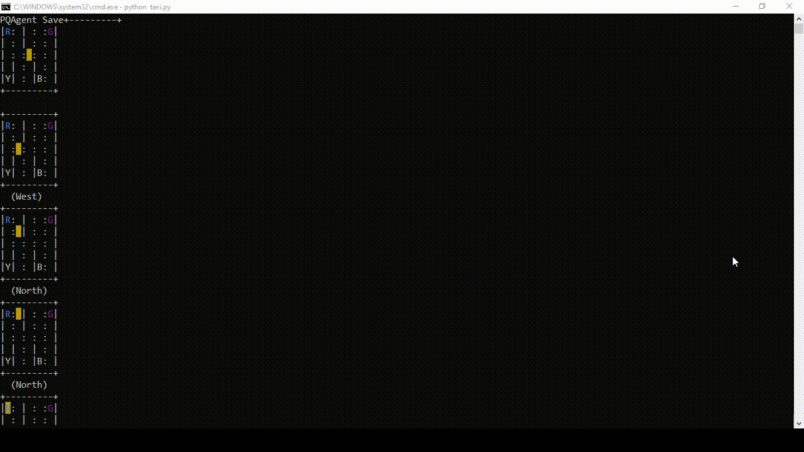

# Taxi-v3

Method 1: Hyperparameter Tuning with QAgent
- Type: Evolution/Genetic Search
- Parameters to Tune: decay max, decay rate, decay min, stochasticity during testing, discounted rate, and learning rate
- Evaluation Function
  - Trains QAgent 20000 episodes
  - Plays 100 episodes with the trained QAgent, returning the average
- Parameters for the tuner
  - Generations: 10 (more than 10 would be better but slower. Ex. 100)
  - Population: 10 (more than 10 would be better but slower. Ex. 1000)
  - Selection Size: 2 (adjust accordingly)
  - Lowest Best: False (Higher average the better)
- Results (note that tested default values were initially provided)
  - Very Slow and inefficient
  - Highest Average for Each Generation (first to last): 8.44, 8.39, 7.9, 8.33, 8.17, 8.23, 8.38, 8.37, 8.3, 8.14
    - Yes, the averages got worse as generations increased (maybe too high of a volatility for the parameters)
  - Best parameters (in order of parameters to tune): .1, .0624, .0344, 0, .2011, .5 

Method 2: Manuel Tuning with QAgent
- Variables: decay type, decay max, decay rate, decay min, stochasticity during testing, discounted rate, learning rate, and number of episodes
- Evaluation
  - Trains X episodes
  - Plays 10, 100, or 1000 trials of 100 episodes and return the best 100 episode average within the trials
- Parameters (for final results):
  - Training Episodes: 20000
  - Discounted Rate: .9
  - learning Rate: .5
  - Policy: Stochastic Greedy Policy
    - Exponential Decay of stochasticity: max(.1 * (1 - .001)^num_steps, .1)
    - No stochasticity for testing
- Results
  - 100 Episodes Best Average Reward out of 1000 trials: 8.79
  - 100 Episodes Worse Average Reward out of 1000 trials: 7.1
  - 100 Episodes Mean Average Reward out of 1000 trials: 7.93

Method 3: Using PQAgent (Allows multiple values for learning rates and discounted rewards)
- Episodes of PQAgent: 20000
- Parameters
  - Discounted Rates Used: .6, 0-1 with 20 steps in between
  - Learning Rates Used: .5, 0-1 with 20 steps in between
  - Policy: Stochastic Greedy Policy
      - Exponential Decay of stochasticity: .1 * (1 - .004)^num_steps
- Evaluation of all the Q tables created by PQAgent
  - For each combination of discounted rates and learning rates play 10 trials of 100 episodes, and if the best 100 episode average within those 10 trials is higher than the current best 100 episode average set that as the new best.
- Results
  - 100 Episodes Best Average Reward: 8.8
    - Discounted Rate: .684
    - Learning Rate: .684
    - Note: The agent with these rates was trained by "hijacking" an agent with a discounted rate of .6 and a learning rate of .5

Notes on the results
- The best result of 8.8 by method 3 and the result of 8.79 by method 2 were both outliers for the agents' performance and the environment state. For instance, the best method 2 agent result of 8.79 was above the mean for the 1000 trials by 3 to 4 standard deviation. Also, a result above 9 was achieved, but the Q-table and parameters were not saved and could be assumed to be an extreme outlier.

Note: The code below uses my [PAI-Utils package](https://pypi.org/project/paiutils/)

Code for all three methods
```python
import numpy as np
import gym
from paiutils.reinforcement import (
    QAgent, PQAgent, StochasticPolicy, GreedyPolicy,
    ExponentialDecay, Decay, GymWrapper
)
from paiutils.evolution_algorithm import HyperparameterTuner


if __name__ == '__main__':
    # Solved ?= 9.7 avg. reward over 100 episodes
    # For v1 solving was 9.7, but there has been changes
    # to the environment since then.

    solved = 9.7
    save_dir = 'taxi_saves/'
    env = gym.make('Taxi-v3')
    max_steps = env._max_episode_steps  # (200)
    env = GymWrapper(env, 500, (6,))

    method_num = 2

    if method_num == 1:
        # SLOW!!!
        hpt = HyperparameterTuner()
        decay_max = hpt.uniform(.1, 1, volatility=.4, inital_value=.1)
        decay_rate = hpt.uniform(0, .1, volatility=.4, inital_value=.04)
        decay_min = hpt.uniform(0, .099, volatility=.4, inital_value=.001)
        stochasticity_testing = hpt.uniform(0, .1, volatility=.4, inital_value=0)
        discounted_rate = hpt.uniform(0.05, 1, volatility=.4, inital_value=.6)
        learning_rate = hpt.uniform(0.05, 1, volatility=.4, inital_value=.5)

        def eval_func(save=True):
            policy = StochasticPolicy(
                GreedyPolicy(), 
                ExponentialDecay(decay_max(), decay_rate(), decay_min()),
                stochasticity_testing(), env.action_shape[0]
            )
            agent = QAgent(env.discrete_state_space, env.action_shape[0],
                           policy, discounted_rate())
            
            agent.set_playing_data(training=True,
                                   learning_rate=learning_rate(),
                                   verbose=False)
            result = env.play_episodes(agent, 20000, max_steps,
                                       verbose=False,
                                       episode_verbose=False,
                                       render=False)

            agent.set_playing_data(training=False)
            result = env.play_episodes(agent, 100, max_steps,
                                       verbose=False,
                                       episode_verbose=False,
                                       render=False)
            if save:
                agent.save(save_dir, note=f'QAgent_{result}_'
                                          f'{decay_max()}_'
                                          f'{decay_rate()}_'
                                          f'{decay_min()}_'
                                          f'{stochasticity_testing()}_'
                                          f'{discounted_rate()}_'
                                          f'{learning_rate()}')
            print(result)
            print(decay_max(), decay_rate(), decay_min(),
                  stochasticity_testing(),
                  discounted_rate(), learning_rate())
            print()
            return result

        hpt.tune(10, 10, 2, eval_func, lowest_best=False, verbose=True)
        print(decay_min(), stochasticity_testing(),
              discounted_rate(), learning_rate())
        print(eval_func(save=True))
    elif method_num == 2:
        policy = StochasticPolicy(
            GreedyPolicy(), 
            ExponentialDecay(1, 0.001, 0.1),
            0, env.action_shape[0]
        )
        agent = QAgent(env.discrete_state_space, env.action_shape[0],
                       policy, .9)
        
        agent.set_playing_data(training=True, learning_rate=.5,
                                verbose=False)
        result = env.play_episodes(agent, 20000, max_steps,
                                   verbose=True,
                                   episode_verbose=False,
                                   render=False)
        agent.save(save_dir)
        agent.set_playing_data(training=False)
        best_result = None
        for _ in range(1000):
            result = env.play_episodes(agent, 100, max_steps,
                                       verbose=False,
                                       episode_verbose=False,
                                       render=False)
            if best_result is None or result > best_result:
                best_result = result
        print(best_result)
    elif method_num == 3:
        policy = StochasticPolicy(
            GreedyPolicy(), 
            ExponentialDecay(.1, 0.004, 0.0),
            0, env.action_shape[0]
        )
        drs = [.6] + np.linspace(0, 1, 20).tolist()
        lrs = [.5] + np.linspace(0, 1, 20).tolist()
        agent = PQAgent(env.discrete_state_space, env.action_shape[0],
                        policy, drs, lrs)
        
        agent.set_playing_data(training=True, verbose=False)
        result = env.play_episodes(agent, 20000, max_steps,
                                   verbose=True, episode_verbose=False,
                                   render=False)
        print(result)
        agent.save(save_dir)
        agent.set_playing_data(training=False)
        best_result = None
        lr = None
        dr = None
        for ndx in range(len(drs)):
            print(f'{ndx + 1}/{len(drs)}')
            for ndx2 in range(len(lrs)):
                agent.set_playing_data(training=False, learning_rate_ndx=ndx2,
                                       discounted_rate_ndx=ndx,
                                       verbose=False)
                for _ in range(10):
                    result = env.play_episodes(agent, 100, max_steps,
                                               verbose=False,
                                               episode_verbose=False,
                                               render=False)
                    if best_result is None or result > best_result:
                        best_result = result
                        dr = ndx
                        lr = ndx2
        print(best_result, lr, dr, lrs[lr], drs[dr])

        agent.set_playing_data(training=False, learning_rate_ndx=lr,
                               discounted_rate_ndx=dr,
                               verbose=False)
        for _ in range(100):
            result = env.play_episodes(agent, 100, max_steps,
                                       verbose=False, 
                                       episode_verbose=False,
                                       render=False)
            if best_result is None or result > best_result:
                best_result = result
        print(best_result)
```

Gameplay from the best agent trained through method 3

